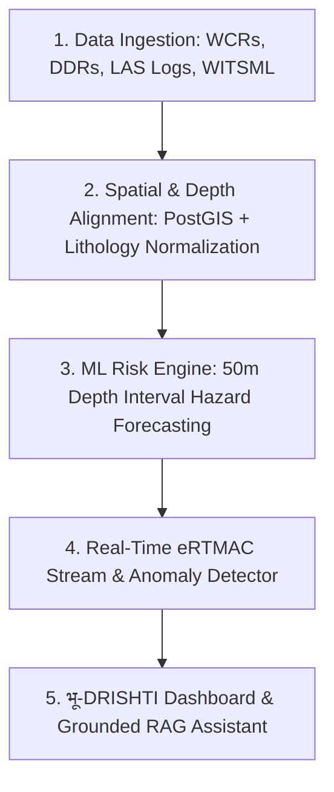

# 🎨 Napkin AI Workflow Diagram Prompt
## 🛢️ भू-DRISHTI (eRTMAC-NWIS) System Workflow
### *Designed for Instant Import into Napkin AI (napkin.ai)*

---

### 📌 How to Use in Napkin AI:
1. Copy the text from **Option 1 (Structured Bullet Steps)** or **Option 2 (Simple Mermaid Diagram)** below.
2. Paste it directly into [Napkin.ai](https://napkin.ai).
3. Click **"Generate Visual"** to automatically create an executive flowchart, icon timeline, or architecture infographic.

---

## ⚡ Option 1: Structured Text Steps (Best for Napkin AI Auto-Visual)

```text
भू-DRISHTI (eRTMAC-NWIS) System Workflow

1. Data Ingestion & Extraction
• Historical Reports: WCRs, DDRs, PDF documents
• Well Logs & Trajectories: LAS files, formation tops
• Live Rig Telemetry: WITSML 1.4.1.1 streams

2. Spatial & Geological Normalization
• PostGIS Radius Search: Locates offset wells (1-50 km)
• Stratigraphic Alignment: Normalizes MD, TVD & TVDSS depths
• Document Parsing: OCR & NLP extract historical drilling events

3. ML Risk & Mitigation Engine
• Hazard Prediction: Forecasts Mud Loss, Kick & Stuck Pipe (50m intervals)
• Multi-Factor Similarity: Geodesic distance + Lithology + Depth match
• Past Playbooks: Surfaces historical mud weights & LCM pills used

4. Real-Time eRTMAC Monitoring
• Live Telemetry Stream: ROP, WOB, RPM, Torque, SPP (1 Hz)
• Anomaly Detection: Isolation Forest detects pressure influxes
• Early Warnings: Instant hazard alerts pushed to field personnel

5. Interactive Dashboard & RAG Assistant
• Visual Risk Profile: Map + Depth-wise hazard curves
• Zero-Hallucination AI Assistant: Answers questions with document page citations
```

---

## 📊 Option 2: Simple Mermaid Diagram (Copy-Paste Ready)



---

## 💡 Quick 4-Box Minimal Workflow (Ultra-Compact Version)

```text
[ HISTORICAL DATA ] ──> WCRs, DDRs, LAS logs & WITSML streams
       │
       ▼
[ INTELLIGENCE ENGINE ] ──> PostGIS spatial search + NLP event extraction + ML risk model
       │
       ▼
[ REAL-TIME eRTMAC ] ──> Live telemetry monitoring + Isolation Forest anomaly alerts
       │
       ▼
[ DECISION DASHBOARD ] ──> Depth-wise risk profile + Past playbooks + Source-cited RAG AI
```
