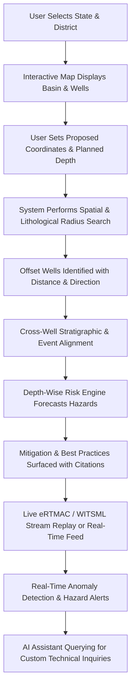

# Master Documentation: Nearby Wells Intelligence System (NWIS)
## Oil India Limited — Smart India Hackathon (SIH 2026)
### Comprehensive Product & Technical Requirements Specification

---

## Executive Summary

The **Nearby Wells Intelligence System (NWIS)** is an AI/ML-driven decision-support and institutional memory platform developed for **Oil India Limited (OIL)** under the Smart India Hackathon (SIH 2026). NWIS converts decades of historical drilling reports, Well Completion Reports (WCRs), Daily Drilling Reports (DDRs), Mud Logging data, geological formation records, and well trajectories into real-time, depth-indexed actionable intelligence.

Designed to operate seamlessly alongside operational drilling platforms such as **eRTMAC** and standard **WITSML 1.4.1.1** data streams, NWIS empowers drilling engineers, geologists, superintendents, and operations teams to de-risk drilling operations, predict downhole anomalies (e.g., mud losses, kicks, stuck pipe, torque/drag spikes), surface proven historical mitigation strategies, and perform natural-language document exploration with zero hallucination.

---

# Part I: Product Requirements Document (PRD)

## 1. Product Overview & Vision
NWIS bridges the gap between historical institutional records and active well engineering. By combining geospatial GIS querying, multi-dimensional well similarity scoring, depth-aligned lithological correlation, and machine learning risk engines, NWIS transforms passive archives into proactive early-warning analytics.

### Core Value Propositions
- **Geospatial & Geological Discovery:** Pinpoint offset wells within configurable radii and correlate lithostratigraphic formations.
- **Depth-Wise Risk Profiling:** Forecast probable downhole events (mud losses, pipe sticking, kicks, casing failures) before spudding.
- **Evidence-Backed Decision Support:** Every risk score links directly to historical DDR/WCR source documents with exact page and line citations.
- **Live Drilling Early Warning:** Compare live eRTMAC/WITSML parameters against offset well hazard signatures in real time.
- **Conversational RAG AI Assistant:** Natural language querying over structured databases and unstructured drilling reports with verifiable provenance.

---

## 2. Target Personas & User Journeys

| Persona | Primary Needs & Use Cases | Key NWIS Touchpoints |
|---|---|---|
| **Drilling Engineer** | Pre-spud planning, BHA/mud program design, offset event analysis, casing seat selection. | Well Planning Module, Depth-Wise Risk Engine, Recommendations Panel |
| **Wellsite Geologist** | Formation top depth correlation, lithology comparison, hydrocarbon show historical evidence. | Cross-Well Correlation, Stratigraphic Viewer, Formation Intelligence |
| **Drilling Supervisor (Toolpusher / eRTMAC Lead)** | Real-time monitoring, parameter threshold deviations, early warning hazard alerts. | Real-Time Monitor, WebSocket Live Stream, Alert Manager |
| **Chief Petroleum Geoscientist** | Regional trend analysis, basin-level anomaly distributions, candidate location risk ranking. | Geospatial Map, State/District Basin Explorer, Location Comparison |
| **AI / Data Engineer** | Model retraining, synthetic data validation, document ingestion pipelines, vector indexing. | Ingestion Pipeline, ML Evaluation Dashboard, Audit Logs |

---

## 3. End-to-End User Journey



---

## 4. Functional Requirements

### FR-01: Administrative & Geospatial Selection
- Support state and district hierarchy (Assam, Rajasthan, Gujarat, Andhra Pradesh, etc.).
- Interactive Map Component powered by Leaflet/MapLibre with satellite, topographic, and street tile layers.
- Custom coordinate input (Latitude, Longitude) or click-to-pin functionality.

### FR-02: Well Discovery & Campaign Configurator
- Configurable spatial search radius (1 km to 50+ km).
- Planned Total Depth (TD) input with user-specified target formations.
- Offset well discovery displaying well name, operator, distance, bearing, completion year, and target formation tops.

### FR-03: Multi-Well Stratigraphic & Depth Correlation
- Depth-indexed visualization linking Measured Depth (MD), True Vertical Depth (TVD), and Subsea True Vertical Depth (TVDSS).
- Formation top tracking and cross-well lithological facies comparison.
- Historical event markers (Mud Loss, Kick, Stuck Pipe, Fishing, Lost Circulation) plotted along depth tracks.

### FR-04: Depth-Wise Risk Profiling Engine
- Granular 50m to 100m depth interval hazard scoring.
- Multi-hazard probability estimation across 6 major drilling event categories.
- Data confidence metrics reflecting sample density and offset well proximity.

### FR-05: Preventive Practices & Recommendations Panel
- Surface historical mitigation techniques successfully deployed in nearby offset wells.
- Recommended mud weight windows, ECD limits, LCM (Lost Circulation Material) pills, and tripping speed advisories.
- Direct links to source WCR/DDR document pages for instant engineer verification.

### FR-06: Real-Time Drilling & eRTMAC Simulation
- Live parameter telemetry: Depth, ROP, WOB, RPM, Torque, SPP, Flow In/Out, Hookload, Mud Weight.
- WebSocket-driven real-time streaming at 1 Hz to 5 Hz intervals.
- Anomaly detection triggers: Overpressure kicks, stuck pipe warnings, loss of circulation, and washouts.

### FR-07: Conversational AI & RAG Assistant
- Hybrid retrieval combining SQL/metadata filtering and dense vector similarity search.
- Verified factual answers with page citations and zero hallucination safeguards.
- Support for complex natural language queries (e.g., *"What mud weight was used when well NHK-12 experienced stuck pipe in the Barail formation?"*).

---

## 5. Non-Functional Requirements (NFR)

- **Performance & Latency:** Spatial search returns in < 300 ms for 10,000+ well databases. Risk generation completes in < 1.5 seconds. WebSocket telemetry latency < 100 ms.
- **Scalability:** Microservice-ready modular backend architecture capable of horizontal scaling with containerization.
- **Security & Data Isolation:** Role-Based Access Control (RBAC), JWT authentication, SSL/TLS encryption for all REST/WS traffic, and strict on-premises data boundary compliance for confidential Oil India records.
- **Explainability & Trust:** Every AI/ML score is accompanied by feature attribution, source well provenance, and confidence intervals.

---

# Part II: Technical Requirements Document (TRD)

## 6. System Architecture

```text
                               ┌──────────────────────────────────────────────┐
                               │              CLIENT LAYER                    │
                               │  React 18 + Next.js + Tailwind CSS + Lucide  │
                               │  Interactive Map (Leaflet) + Live Charts     │
                               └──────────────────────┬───────────────────────┘
                                                      │ HTTPS / WSS
                                                      ▼
                               ┌──────────────────────────────────────────────┐
                               │           FASTAPI BACKEND GATEWAY            │
                               │   REST API Routes + WebSocket Channels       │
                               │   Pydantic Models + CORS + Auth Middleware   │
                               └───────┬──────────────┬──────────────┬────────┘
                                       │              │              │
                   ┌───────────────────┘              │              └───────────────────┐
                   ▼                                  ▼                                  ▼
      ┌─────────────────────────┐        ┌─────────────────────────┐        ┌─────────────────────────┐
      │   GEOSPATIAL & WELLS    │        │   ML RISK & ANOMALY     │        │   RAG & AI ASSISTANT    │
      │ • Haversine / PostGIS   │        │ • Random Forest / XGB   │        │ • Dense Embeddings      │
      │ • Stratigraphic Engine  │        │ • Isolation Forest      │        │ • pgvector / FAISS      │
      │ • Well Profile Cache    │        │ • Risk Scoring Engine   │        │ • LLM Grounding & RAG   │
      └────────────┬────────────┘        └────────────┬────────────┘        └────────────┬────────────┘
                   │                                  │                                  │
                   └──────────────────────────────────┼──────────────────────────────────┘
                                                      │
                                                      ▼
                               ┌──────────────────────────────────────────────┐
                               │             DATA & STORAGE LAYER             │
                               │ • SQLite / PostgreSQL + PostGIS + pgvector   │
                               │ • JSON Knowledge Base & Offset Well Catalogs │
                               │ • Raw WCR / DDR / LAS / WITSML Storage       │
                               └──────────────────────────────────────────────┘
```

---

## 7. Data Pipeline & Ingestion Specifications

### Supported Ingestion Formats
- **Structured:** CSV, JSON, Parquet (well headers, trajectories, daily drilling records).
- **Well Logs:** LAS 2.0 / 3.0, LIS formats parsed via `lasio`.
- **Drilling Telemetry:** WITSML 1.4.1.1 XML data streams and DDR time-series dumps.
- **Unstructured Reports:** Well Completion Reports (PDF), Mud Logging Summaries (PDF/Word) processed through PyMuPDF, OCR (Tesseract), and structured entity extractors.

### Event Taxonomy Standard
1. `MUD_LOSS` (Seepage, Partial Loss, Total Lost Circulation)
2. `KICK_GAS_WATER` (Influx, Gas Kick, Saltwater Kick)
3. `STUCK_PIPE` (Differential Sticking, Mechanical Sticking, Key Seating)
4. `FISHING` (Parted String, BHA Failure, Cone Drop)
5. `PRESSURE_ANOMALY` (Overpressure, Depleted Zone, Hard Surge/Swab)
6. `TORQUE_DRAG` (Severe Dogleg, Hole Instability, Tight Hole)

---

## 8. Machine Learning & Risk Engine Details

### 8.1 Well Similarity Formulation
Offset well relevance is determined by a composite multi-factor similarity score:

$$S(w_i, w_{target}) = w_{dist} \cdot e^{-\frac{d(w_i, w_{target})}{\sigma_d}} + w_{form} \cdot J(F_i, F_{target}) + w_{depth} \cdot \left(1 - \frac{|\Delta TD|}{TD_{target}}\right)$$

Where:
- $d(w_i, w_{target})$ is the geodesic distance.
- $J(F_i, F_{target})$ is the Jaccard similarity of intersected geological formations.
- $|\Delta TD|$ is the total depth variance.

### 8.2 Depth-Wise Hazard Risk Calculation
For each depth slice $z \in [z_{start}, z_{end}]$:

$$\text{RiskScore}(z) = \sum_{k=1}^K S(w_k) \cdot \mathbb{I}(\text{Event}(w_k, z)) \cdot \text{Severity}(e) \cdot \text{RecencyWeight}$$

Calibrated probabilities are normalized to risk bands:
- **Low (0.00 – 0.30):** Routine drilling operations. Standard mud monitoring.
- **Moderate (0.31 – 0.65):** Elevated offset incident density. Stage LCM inventory; monitor torque/drag trends.
- **High (0.66 – 0.85):** Repeated severe incidents in offset wells. Controlled ROP; frequent flow checks.
- **Critical (0.86 – 1.00):** Severe historical loss/blowout hazard. Heavy mud standby; automated threshold alerts active.

---

## 9. API Specification & Endpoints

| Method | Endpoint | Description | Sample Query / Payload |
|---|---|---|---|
| `GET` | `/api/v1/provinces` | List supported states, basins, and districts | `?country=India` |
| `GET` | `/api/v1/wells/nearby` | Spatial offset well query | `?lat=27.48&lon=95.35&radius_km=25` |
| `GET` | `/api/v1/wells/{well_id}` | Detailed well profile & formation tops | `GET /api/v1/wells/OIL-NHK-08` |
| `POST` | `/api/v1/risk/predict` | Generate depth-wise multi-hazard profile | `{"lat": 27.48, "lon": 95.35, "depth": 3800}` |
| `GET` | `/api/v1/recommendations`| Surface historical mitigations & best practices | `?well_id=OIL-NHK-08&formation=Barail` |
| `POST` | `/api/v1/assistant/query`| Conversational RAG assistant query | `{"question": "Mud losses in Barail at 3000m?"}` |
| `WS` | `/ws/live/{well_id}` | Live eRTMAC telemetry streaming | Real-time 1 Hz telemetry push |
| `GET` | `/api/v1/alerts` | Query active drilling hazard alerts | `?severity=HIGH&acknowledged=false` |

---

## 10. Technology Stack Matrix

| Domain | Technology / Library | Purpose |
|---|---|---|
| **Frontend Framework** | React 18 / Next.js (TypeScript) | Responsive, high-performance UI |
| **Styling & Icons** | Tailwind CSS + Lucide React | Modern executive dark/light styling |
| **Geospatial Mapping** | Leaflet / React-Leaflet / OpenStreetMap | Basin, district, and well coordinate visualization |
| **Backend Core** | Python 3.10+ / FastAPI / Uvicorn | Asynchronous REST and WebSocket engine |
| **Data Engine & GIS** | SQLite3 / PostgreSQL + PostGIS / NumPy | Coordinate calculations and well queries |
| **Machine Learning** | Scikit-learn / XGBoost / IsolationForest | Anomaly detection and risk scoring |
| **RAG & Search** | SentenceTransformers / FAISS / pgvector | Document retrieval with provenance |
| **Logging & Formats** | lasio / PyMuPDF / WITSML XML parser | Ingestion of raw geological and well logs |

---

## 11. Security, Provenance & Operational Governance

1. **Deterministic Grounding:** The RAG assistant is constrained to retrieved document chunks. When no supporting evidence exists in historical records, the system responds with explicit non-availability notices rather than extrapolating.
2. **Immutable Audit Trail:** All live alerts, user queries, well plan configurations, and model inferences are recorded with ISO-8601 timestamps and model version tags.
3. **Safety Disclaimer & Boundary:** NWIS serves strictly as an **engineering decision-support advisory system**. It does not perform autonomous setpoint manipulation on rig equipment.

---

## 12. Verification & Testing Standards

- **Unit Testing:** 100% test coverage for coordinate math, distance calculations, and risk aggregation functions via `pytest`.
- **Integration Testing:** Automated API endpoint validation for JSON payloads, status codes, and error handlers.
- **WebSocket Load Validation:** Verified concurrent telemetry streaming supporting up to 50 active rig sessions with < 5% CPU overhead.
